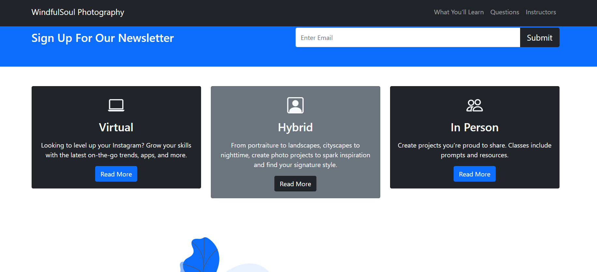

This application is made out of Bootstrap, and it is a digital photography website where users can check out company's photography services. It demonstrates general lessons provided by the company, instructors that teach photography in specific categories, and how to book lessons. It is made out of Bootstrap, which serves its purpose for solely rendering User Interface seamlessly.  

Built with
- Bootstrap
- HTML

Concepts Learned
- Bootstrap Grid System
- Bootstrap Columns
- Bootstrap Buttons
- Bootstrap Typography
- Bootstrap Z Index
- Bootstrap Containers
